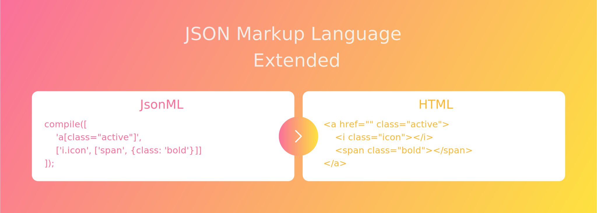

# JSON Markup Language - Extended

[](http://npmjs.com/package/jsonml-ext)
[](https://travis-ci.org/tristanMatthias/jsonml-ext)
[](https://codecov.io/gh/tristanMatthias/jsonml-ext)

Extended renderer for [JSON Markup Language](http://www.jsonml.org/). Renders JSONML to a HTML string with addition of [Emmet's abbreviation expander](https://www.npmjs.com/package/@emmetio/expand-abbreviation)


## Motivation

This project exists to compile JSON Markup language to HTML with the added benefit of using Emmet's abbreviations to simplify the code and workflow.


## Installation
```
yarn add jsonml-ext
```
This will install the package into your project.


## Usage & options
Read the [JSONML website](http://www.jsonml.org/) for more information on JSONML.

Once installed, you can import and render JSON ML arrays into HTML strings:
```js
const {compile} = require('jsonml-ext');

let html;
html = compile(['div']);
// <div></div>

html = compile(['button', {class: 'red', disabled: true}]);
// <button class="red" disabled="true"></button>

html = compile(['div', [['a', {target: '_blank' }]]]);
// <div><a href="" target="_blank"></a></div>
```

**The JML Item**
The JML item passed in contains up to 3 items:
1. The Emmet abbreviation to be expanded. EG: `a#clickme[target="_blank"]`
2. The attributes as a JSON object, OR a nested array of JML items
3. Array of JML items. This item can only be passed if the attributes in item 2 was passed

EG:
*Simple usage*
```js
// Pass in only the first item
compile(['div#test']) // => '<div id="test"></div>'
```
*Attribute usage*
```js
// Pass in the first item and it's attributes
compile(['div[class="red"]', {class: "override"}]) // => '<div class="override"></div>'
```
*Nested variation 1*
```js
// Pass in the first item and the nested items as the SECOND item
compile(['div[class="red"]', ['span']]) // => '<div class="red"><span></span></div>'
```
*Nested variation 2*
```js
// Pass in the first item, it's attributes, and the nested items as the THIRD item
compile(['div[class="red"]', {class: "override"}, ['span']]) // => '<div class="override"><span></span></div>'
```


## Contributions
All pull requests and contributions are most welcome. Let's make the internet better!


## Moving forward / TODO
- [x] Add tests


## Issues
If you find a bug, please file an issue on the issue tracker on GitHub.


## Credits
This project is built and maintained by [Tristan Matthias](https://github.com/tristanMatthias).
